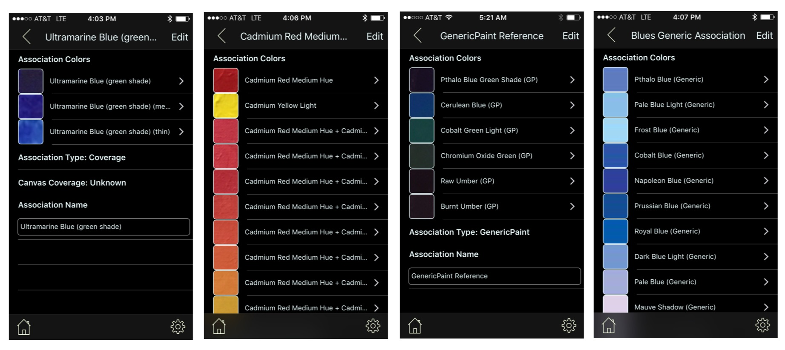

## Association Types
 
 There are five types of associations created through the manual or bulk [__data capture__](DataCapture.md) methods:

* ___Coverage___ associations, as shown in the first screenshot below, are related paint _references_ with varying HSB/RGB values, each the result of a different paint application thickness (i.e., in a _thin_ application, to the degree that the underlying canvas shows through, will yield different values than a _thick_ application that fully blocks the canvas)

* ___Mix___ associations (screenshot 2) are produced by mixing two _reference_ paints (first two rows). Each resulting mix (remaining rows) captures a unique blend or _mix ratio_ of the reference paints.

* ___GenericPaint___ associations (screenshot 3) are collections of _named acrylic paint swatches_ that are associated with specific paint reference brands/mixes but are presented as generic since they come from external sources and data capture methods haven't been validated. Since the sources are acrylic paints (though only the RGB derived values are rendered), these swatches are used by default in the matching process. They are identified as type _GenericPaint_ and have the '(GP)' suffix in the swatch names.

* ___Generic___ associations (final screenshot) are collections of _named swatches_ that are not associated with specific paint references or mixes. They are used as "fillers" during the matching process to identify a color by name in the absence of close paint matches (they may optionally be filtered out in _Settings_). While most Generic associations use a _Color Wheel_ relation for the association, other rules have also been used.

* ___Other___ associations (not shown) are collections of two or more elements that don't fit into the categories outlined. For example, an artist might create an association of paint mixes that were used for a specific work. The 'Comments' and/or 'Keywords' fields might be used, in this case, to capture additional content related to the association.

All these assocations are implemented as collection views with no size limitations. Some are as small as 2 (typically Coverage assocations) or may contain well over 100 items as is the case with a few of the Generic associations.

