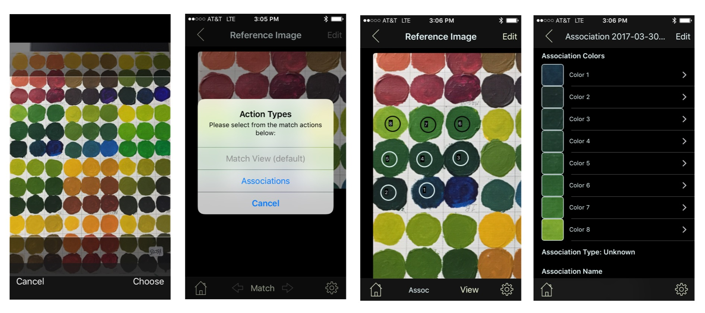
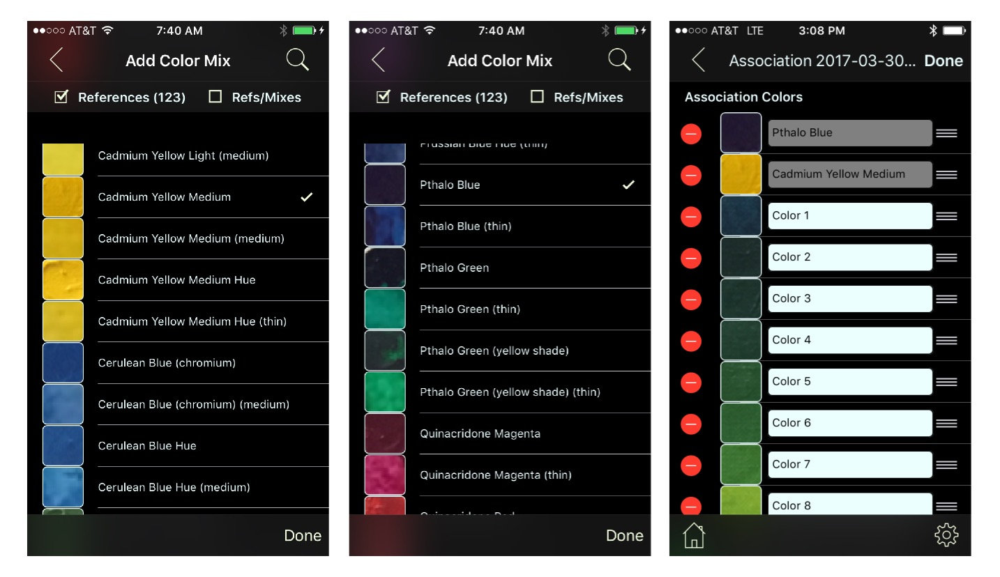
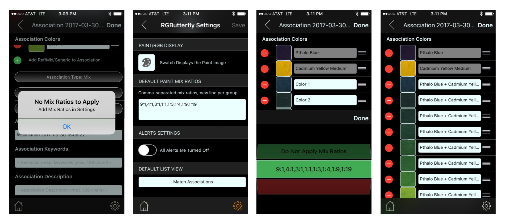
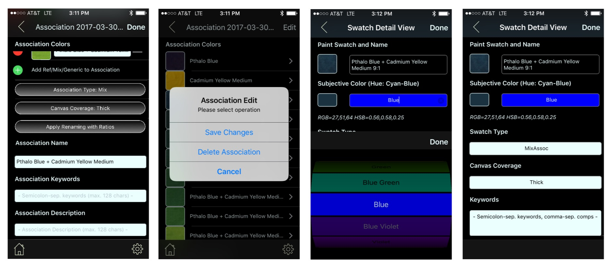
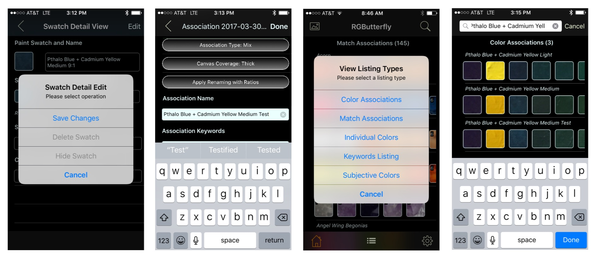

## Manual Data Capture Session

 The next few sets of screenshots describe the manual data capture process in more detail. As shown in the figure below (left screenshot), the user selects or takes a photo of the desired paint swatches. Since this is a data capture we will change the Action Type to _Associations_ and tap each paint swatch that will be used to create our mix association (screenshots 2 & 3). Note that we did not tap on the swatch that is at the bottom right of the quadrant even though it is part of this association. That is because that reference color (Pthalo Blue) already exists in our database and will be integrated referentially. Likewise, the second reference color (Cadmium Yellow Medium) that is part of our mix (not shown) will also be integrated referentially.

Clicking on the _View_ (bottom toolbar, right hand side) will take us to a new _Mix Association_ View that shows the selected colors listed tabularly with their assigned generic name (clicking on this button also auto-creates the association and its related elements)

Clicking the _Edit_ button (top right) in our Mix Association view gives us the option of adding the reference colors (first two screenshots below) mentioned earlier by tapping the '+' green button. In this mode (third screenshot) we are also able to modify the color order, remove elements, and/or edit the new color names (with the exeption of the reference colors) though generally none of this should be necessary as I will show below.

The next step is to set the _Association Type_. This can be done (while still in _Edit_ mode) by clicking on the green 'Association Type' button and selecting the _Mix_ option. After this action, two new green buttons automatically appear: The _Canvas Coverage_ and the _Apply Renaming with Ratios_. For now we will focus on the latter.

The ratios in this context specify the mix proportions. In this example, a "9:1" ratio would mean _9 parts Pthalo Blue and 1 part Cadmium Yellow Medium_. Associating an existing set of ratios with our target mix will allow us to automatically rename  each color in our association to include the appropriate ratio.

As seen in the first screenshot below, we get the alert _No Mix Ratios to Apply_ when attempting to apply the auto-renaming. To fix this, we can go into _Settings_ (by clicking the bottom right gear button), entering the desired ratios, and going back to our association after saving the new setting (see screenshot 2). When we now attempt to apply renaming we get a green option in our selection that shows the ratios we just entered (screenshot 3). After applying the selection, each mix color in our example will be automatically renamed to _Pthalo Blue + Cadmium Yellow Medium desired-ratio_ (screenshot 4).

___Note: Reference and Mix colors need to be in the desired order when applying renaming!___

The next step (screenshot 1 below), is to optionally add additional properties to the Mix Association. We can now revisit the _Canvas Coverage_ and set this value to "Thick". The "Association Name" was automatically created during the rename step but it can be optionally modified. Finally, "Association Keywords" and an "Association Description" can also be set (though we will leave them empty). With our target fields/selections set we can now tap on the _Done_ button and select "Save Changes" (screenshot 2).

It is important to note that each color in the mix has an associated detail object automatically created. In addition, this object inherits the _Mix Name_, _Association Type_ and _Canvas Coverage_ properties (of course, any of these properties can be overriden but that is typically not desired)

Clicking on the '>' to the right of an association will bring up the _Swatch Detail View_ (screenshots 3 & 4). Notice that in this view the _Paint Swatch and Name_, _Canvas Coverage_ and _Swatch Type_ are already set (as inherited by the parent Mix) but we will set the _Subjective Color_ from the pull down (there is also a suggested "Hue" value that is automatically computed from the Color Wheel values). Note that there is also a _Keywords_ field. Typically, this field is left empty during this process as these keywords are normally associated with a Match Tap Area. 

We are now ready to complete the process in our Data Capture Session. We will first click on the _Done_ button and an Alert will give us the option to "Save Changes" (screenshot 1). After saving, we can go back to our _Association_ view (by clicking the "<" navigation button on the top left). As shown on screenshot 2, we will make some minor changes to the "Association Name" by adding a " Test" at the end (since a previously created association already exists with the current name) and save these changes. Finally, we can click on the home button (bottom left) which will takes us back to the Main View. Since our default view is not _Color Associations_, we can now click on the list icon (bottom middle) and select that type (screenshot 3). Clicking on the Search magnifier icon (top left) will display the search field which will help us find our new association and confirm that it is listed (final screenshot). 

Other swatch types that are captured include _Generic_, _GenericType_, and _Coverage_. Thought the capture method is the same, the sources and relations between elements are different. These types are discussed in further detail [__here__](Associations.md).

## Bulk Data Capture

The _Generics_ type is currently loaded using this method (i.e., CSV files). Work is being done to extend bulk loading to include Paint Swatches as well as allow users to import their own data from various sources such as Cloud directories or using REST APIs.

