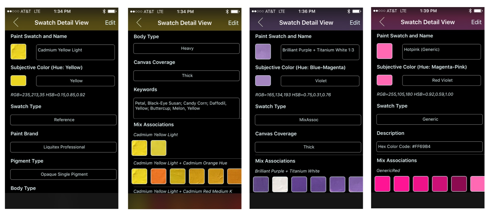

## Swatch Detail Views
 
 The screenshots below show the three different types of detailed views in _Non-Edit_ mode (in _Edit_ mode, unless Swatch is set to read-only, Text fields/views become editable and Picker views selectable).

The ___Reference___ detail view (screenshots 1 & 2) contains most of the data associated with a Paint Swatch including:
* Swatch Paint Thumbnail and Name
* Swatch RGB Thumbnail, Color Derived Hue Name (in parenthesis), and Subjective Color (user selectable)
* RGB and HSB values (non-editable derived label)
* Swatch Type (user selectable, determines what other fields will be visible/applicable)
* Paint Brand (user selectable but if 'Other' is selected a custom value can be entered)
* Pigment Type (user selectable from a number of permutations)
* Body Type (user selectable and generally 'Heavy' as indicated in the Paint Brand label)
* Canvas Coverage (user selectable and generally 'Thick' refers to the degree in which canvas shows through)
* Keywords linked to this swatch through the _Match_ process (semi-colon separated if more than one)
* Comments (not shown as empty text field/views remain hidden in non-edit mode)
* Mix Associations linked to this swatch (in below example, they include a _Coverage_ and various _Mix_ associations)

The __MixAssoc__ detail view (screenshot 3) contains only data applicable to the Mix as the reference data associated with each mix component has already been captured. The _Name_ field (usually auto-generated) contains the names of references that go into the mix plus the _mix ratio_ appended to the end. Not shown in this example are the _Keywords_ and _Comments_ fields which remain hidden when empty and in non-edit mode.

The __Generic__ detail view (screenshot 4) contains similar content as the _MixAssoc_ view with the _Canvas Coverage_ field missing as no paints are involved in creating these types of swatches. By convention, the name has the suffix '(Generic)'.

The __GenericPaint__ detail view (not shown) contains similar content as the Generic one with the _Canvas Coverage_ field present as acrylic paints are the (second-hand) source for these swatches. These types are identified by the 'GenericPaint' swatch type and the name suffix '(GP)'.

