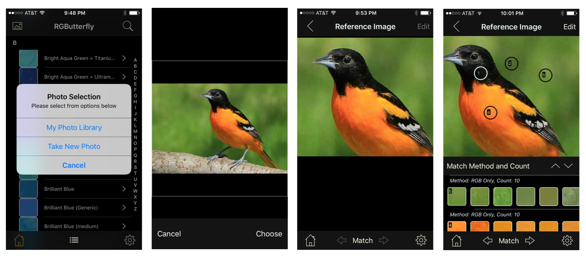
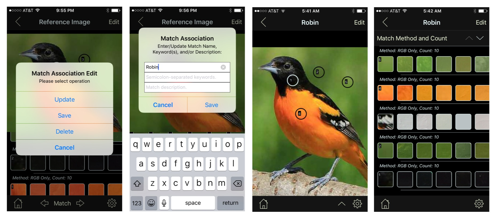
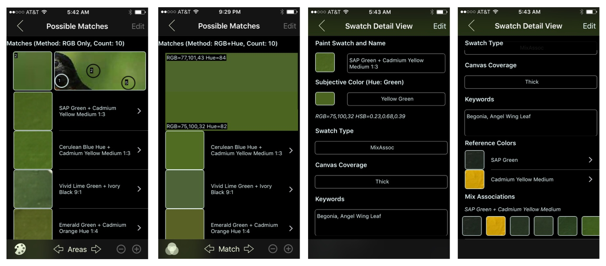
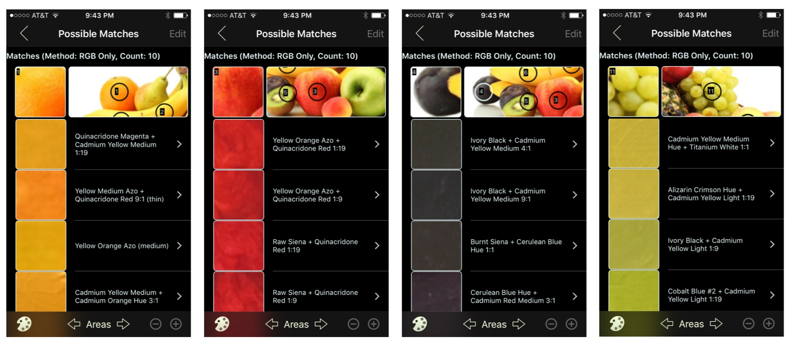

## Paints Suggestion Examples

 The set of screenshots that follow show examples of the _Paints Suggestion_ functionality.

The first step is to integrate an image. This can be initiated by clicking on the _photo_ icon top-left of the Main View (screenshot 1 below). Once the image (or photo taken) is selected it can be positioned in the _Match_ type (default) view that is part of the _Image View_ (screenshots 2 & 3).

As shown in the final screenshot, single tapping on the image will create a numbered circle or square surrounding the tapped area and, along with it, a new row in the table area below the image. The left-most item in this row, corresponds to the tapped section thumbnail and the remaining items (scrollable right-to-left) the closest paint matches derived from applying a Match Algorithm (in this case the _RGB Only_ method). The default items _Count_ is configurable is the _Settings_ view and currently defaults to 10.

By moving the image around you can reveal the areas not shown. To remove a tapped area simply tap on the image area you wish to remove and both tapped area and table entry disappear instantly.

To view (or uncover) additional rows in the table scroll up/down or click on the _arrow up_ button as described below.

_Note: The Match view currently does not support Landcape Orientation_

Clicking on the top-right _Edit_ button will generate an alert with a number of options (screenshot 1 below). Clicking on _Update_ will allow us to modify the generic name to "Robin" (for now, we will leave the keywords and description fields empty) and _Save_ will commit our changes (screenshot 2).

Notice that the display can be modified to _Image Only_ (arrow down button) or _Table Only_ (arrow up button) as shown in screenshots 3 & 4.

At this point we are ready look at some more detailed information about our matches. Clicking on one of the rows on the table (in our example we picked 2) will bring us to the _Possible Matches_ view (screenshot 1 below)

In this view the top row is stationary and contains the tap area thumbnail (left item) and a sub-section of the larger image that includes the tap area for context (right item). The remaining scrollable rows represent the returned _Paint Swatches_ associated with the _Tapped Area_ in the order best match at the top (as applied by the selected algorithm).

Note that by default, the middle button in the bottom toolbar displays "Areas". In this setting we are able to instantly page through all the tap areas associated with the image by using the adjascent arrows (see last set of screenshots for an example). In screenshot 2, we have changed the value of this button to "Match" which allows us to instead test the various algorithms against a single tap area using the same adjascent arrows (in this specific example we changed from _RGB Only_ to _RGB+Hue_ which, at least for the top matches, produced the same results)

Notice also that by clicking on the "Pallete" icon (bottom left) we changed it's text to "RGB" which results in rendering all swatches using their corresponding RGB color values instead of paint thumbnail.

Finally, by long-pressing out top swatch we can instantly enlarge it for easier comparison against the reference tapped area.

Screenshots 3 & 4 show the _Swatch Detail_ view in this case, accessed by clicking on our top match row. It is here, if match turns out to be a good one, where we would want to add keywords associated with the Paint Swatch (which would instantly be integrated into our _Keywords Listing_)

The final set of screenshots below exemplify the "Areas" navigation described earlier. 

