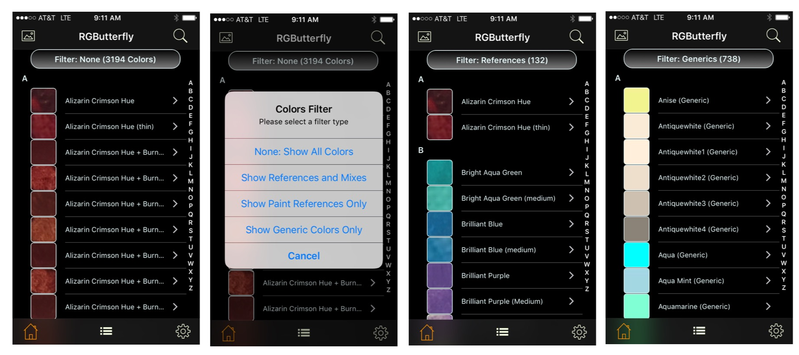

## Individual Listings
 
 In this view, the header button can be used to select from four types of filters (screenshots below). Filter _None_ (screenshot 1) list all colors and, as with all other filters, the aggregate count is displayed in parenthesis. The remaining filters are _References and Mixes_, _References_ only, and _Generics_ only (which includes type _GenericPaint_). The top-right search button and/or letter index on the right can also be used to further refine the listings.

Though the _Portrait_ orientation is generally recommended for viewing/accessing most listings, the _Landscape_ orientation  (particularly with the individual listings) makes it easier to read the longer _Mix_ names. Slight changes to accomodate the new layout include dropping the letter headers visible during scrolling and dropping every third letter on the index in order for it to fit (two additional letters are dropped for devices with screens smaller than iPhone 6)

