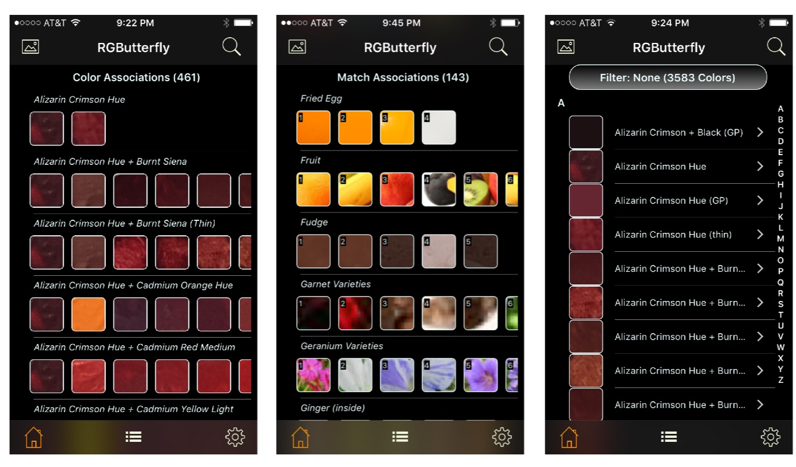
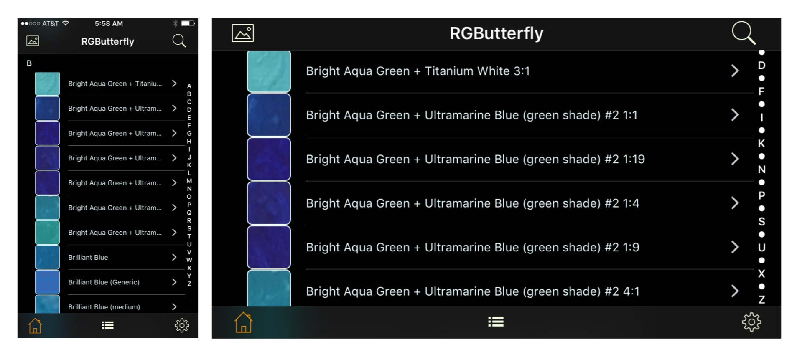
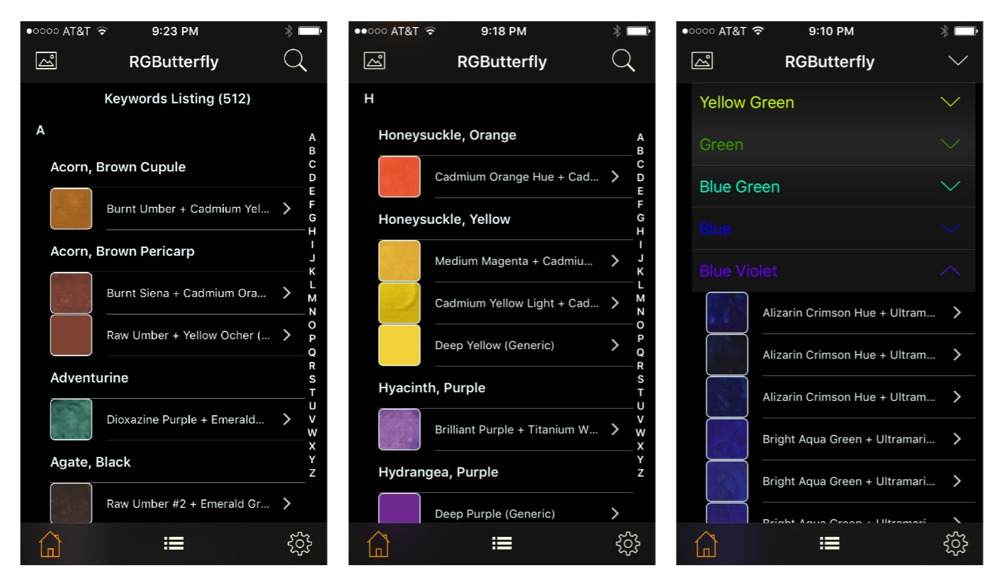
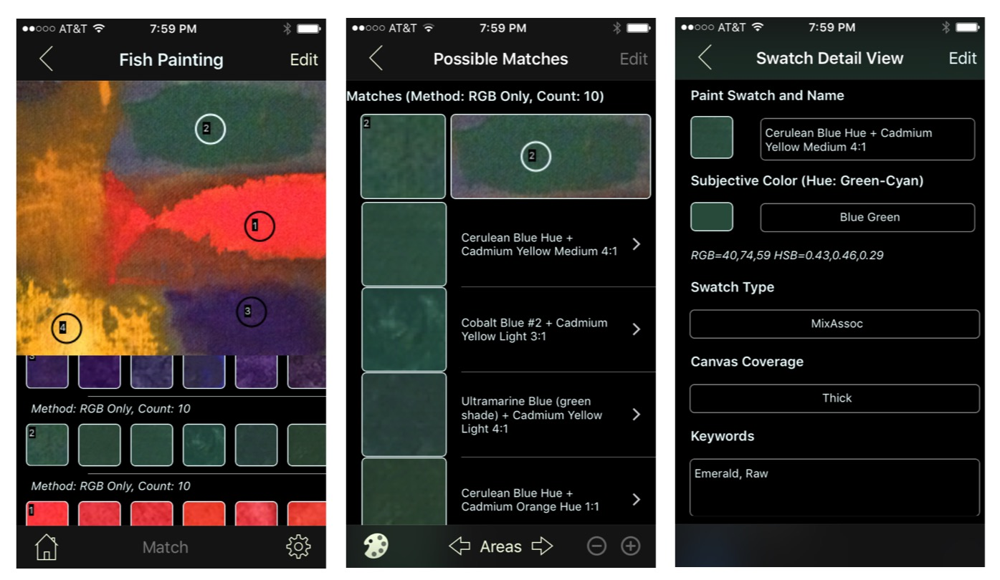
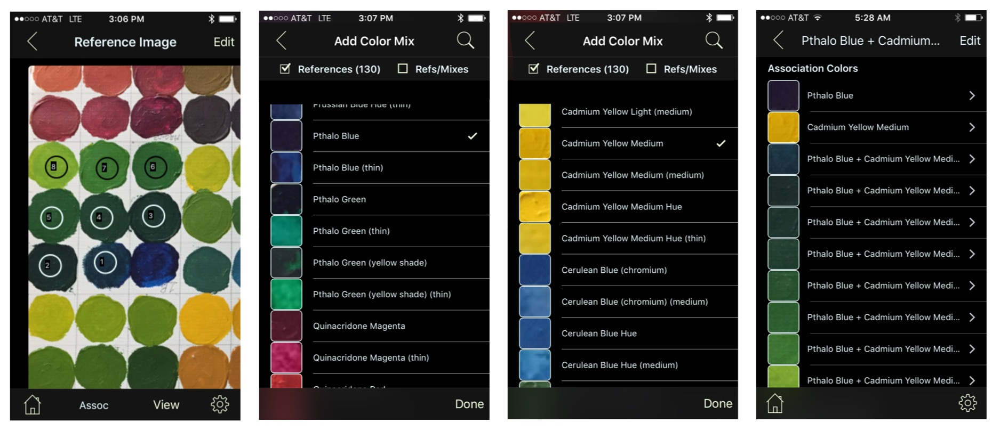

# [RGButterflyTechDocs](http://rgbutterfly.com/)

## Overview

 The main purpose of this iPhone App is to suggest matching paint colors for selected areas of a photo. It does this by applying a _Match Algorithm_ against a database of paint colors. The key word is _attempt_
as there is much variability in the process and the results obtained may often be far from what you might expect (please review the [__About__](About.md) and [__Disclaimer__](Disclaimer.md) sections to learn more and, if your are interested in the technical side of things, the [__Programming Considerations__](Programming.md) section)

The three broad capabilities for the App are __Reference & Search__, __Paints Suggestion__, and __Paints Data Capture__.

### Reference & Search

The main view allows a user to switch between the five types of displays (shown in the screenshots that follow):

* __Match Associations__ (default view): An alphabetized list of photo-area collections that are part of a common photograph (each area linked to a set of suggested matching paints)
* __Color Associations__: An alphabetized list of color associations
* __Individual Colors__: An alphabetized list of the individual colors that can be filtered by category
* __Keywords Listing__: An alphabetized list of keywords and their associated paints colors
* __Subjective Colors__: Colors grouped by color-wheel categories

For a given association row (first two screenshots below), scrolling right to left exposes remaining elements of the collection and clicking on it reveals the [__Association Detail View__](Associations.md). For the [__Individual Colors__](Individual.md) listing (third screenshot), clicking on a row takes you directly to the [__Swatch Detail View__](Detail.md).

Rotating to landcape, as shown below, makes it easier to read the full names which is especially useful for _mix_ names.

The _Keywords Listing_ (first two screenshots below) provides a way to easily locate keyword-color associations. The _Subjective Colors_ listing (third screenshot) buckets colors into _Color Wheel_ groups. In this view, the elements of one or more groups can be revealed/hidden by clicking on the corresponding down/up arrow widgets.

All listings, with the exception of _Subjective Colors_ are alphabetized and include the top-right magnifier __Search__ button (search rules vary between listing). The _Individual Colors_ and _Keywords Listing_ views also provide an __Alphabetical Index__ widget for quick access.

### Paints Suggestion

A new photo or an existing one can be used by clicking on the top-left photo icon. The screenshots below show the general sequence of events for this type of capture. More detailed examples of this functionality can be found __[here](ImageMatch.md)__.

### Paints Data Capture

Photographed paint swatches can be tapped and integrated into a _Mix Association_ as shown in the screenshots below. The _Add Color Mix_ feature (screenshots 2 & 3) allows users to add existing reference colors to the mix. A more detailed example can be found __[here](DataCapture.md)__.

### Settings

The Settings view, accessible from the bottom-right gear button, enables global App customizations. Other features include the _About this App_ and _Disclaimer_ pages, links to the _Web Documentation_, a _Provide Feedback_ link, and _Share_ buttons (i.e., Facebook, Twitter, and so on). More about this view can be found [__here__](Settings.md). 

### Privacy, Access and Alerts

This App does not store user or location information. Specific privacy settings must be enabled in order to access the Camera or Photo Library. Alerts are issued under several conditions (though most are informational). More on _Access and Alerts_ can be found __[here](AccessAndAlerts.md)__.  

### Programming Considerations

[__This__](Programming.md) section gives a mostly high-level overview of the program structure and development process.

### Future Directions

Though App is pending release, there are a number of new features that I am looking to implement as well as existing ones that I plan to revisit for future releases (the initial build 10.1 (2) also has some of the functionality disabled). Enhancements include:

* __Re-enable the Paints Data Capture and much of the editing functionality__
* __Continue Improving the Data Capture__
* __Extend the Dataset__ by adding Paints and additional Keywords associations
* __Revisit the Match Algorithms__ and perhaps even look into data derivation formulas
* Consider __Deployment to Other Platforms and/or Device Types__
* Address __Internationalization/Localization__ issues
* __Improve Usability__ (covers things like improvements to the UI/Graphics and new User Settings, such as Fonts and Thumbnail sizes)
* __Revisit the Current Data Storage Model__ (perhaps consider centralized data storage and queries)
* In some ways similar to the preceding point, __make it easy to share swatch data__

For questions/comments about this App please email me at [svpineo@gmail.com](mailto:svpineo@gmail.com)

_Note: Clicking on this  logo will get you back to this main page_.

