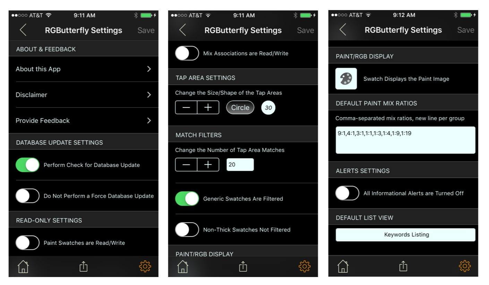
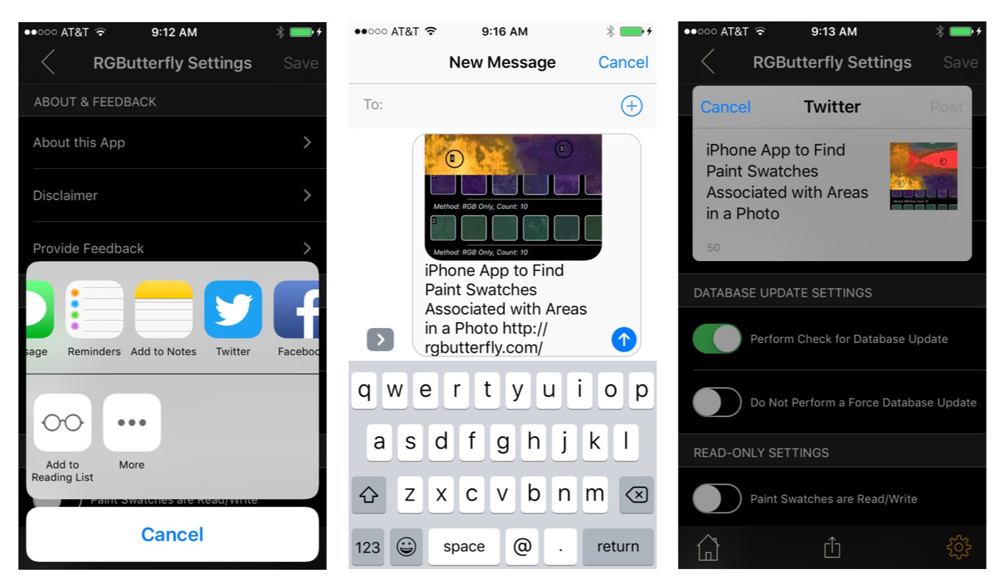
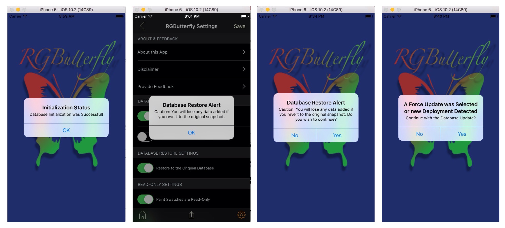

## Settings
 
 Global App customizations using the Settings controller include:

* Checks for Database Updates, which allows users to perform updates when available
* Database Restore, which allows users to restore to the original _release bundled_ snapshot
* Optionally setting Paint Swatches and/or Mix Associations to Read-Only for protection
* Changing the default shape (i.e., circle or rectangle) and size of a tap area
* Changing the number of tap area matches displayed and/or filtering certain swatches (i.e., Generics)
* Displaying Paint Swatches as captured or alternatively, rendered by RGB value
* Entering the _Mix Ratios Set(s)_ used for data capture
* Turning Off Informational Alerts
* Setting the default _Initial_ view

The 'Save' button (top right) is disabled unless any of the settings have been modified. An alert is also issued if, after making changes, user attempts to leave the controller without saving. The screenshots below capture the _Settings_ view.

A few other features included in this controller are the 'About this App' and 'Disclaimer' pages (both with links to the Web documentation), the 'Provide Feedback' link for sending an email, and the share button (bottom middle). This latter functionality (example screenshots shown below) allows the user to share the Web documentation via a selection of available Apps such as Email, Messenger, Twitter, and Facebook.

### Database Updates

There are four cases of database updates with three of them enabled through _Settings_.

* The _Initialization_ (completion alert shown in screenshot 1 below) occurs automatically whenever the App is first deployed to a device or the _Reset Content and Settings..._ option selected for a simulator. It involves provisioning the latest database snapshot from the localized _Bundle_ installed with the App.

* The _Restore_ case allows the user to restore to the original database. Since this operation will discard user data added since the App installation or latest upgrade, a cautionary warning (with option to back out) is issued when first selecting the Settings option (screenshot 2) as well as prior to the actual restore operation (screenshot 3).

 * The _Version Driven Upgrade_ (screenshot 4 prompt) allows the user to upgrade to a later version provided one is available (The _Perform Check for Database Update_ switch must be turned on in order to poll the remote REST API).
 
 * The _Force Update_ (also screenshot 4 prompt) allows the user to provision the latest version even if an upgrade is not detected (The _Update Even if Versions are Unchanged_ switch must be enabled for this option)
 
 The version and force updates will be enabled for merging in the next release (the current operation is replacement) 

